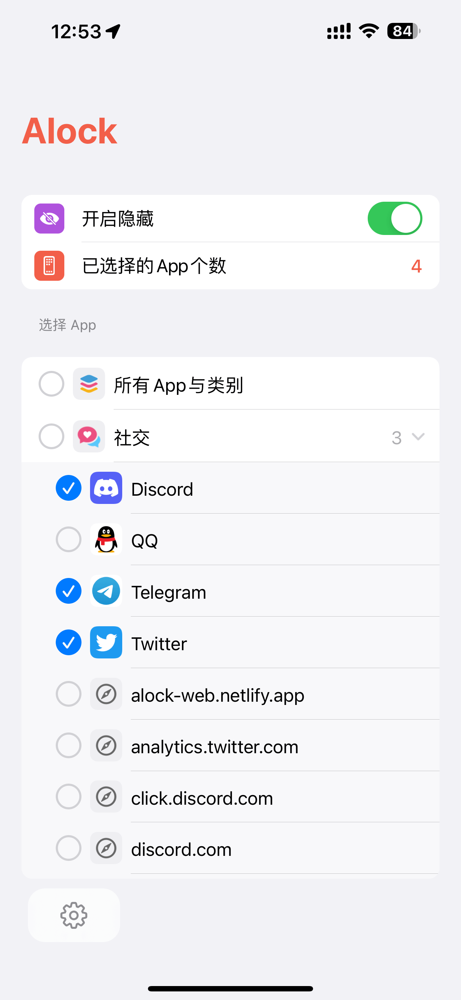

<h1 align="center">Alock</h1>

<h4 align="center">Alock 是一款免费用于隐藏指定 App 的应用。使用 Alock 可以彻底地从 iPhone/iPad 上隐藏指定的 App，隐藏后的 App 在主屏幕、App资料库、搜索、系统设置中均不可见。最大程度保护您的隐私。 </h4>

<p align="center">
  
</p>

**由 [react-native-boilerplate](https://github.com/luoxuhai/react-native-boilerplate) 提供支持。**

## 安装

### 使用爱思助手

1. 下载 ipa 安装包：<https://github.com/luoxuhai/Alock/releases/tag/v1.0.1>
2. 下载爱思助手：<https://www.i4.cn/>
3. 使用爱思助手安装应用：<https://m.i4.cn/article/14666.html>

### 已有开发环境

```bash
cd Alcok

npm install

npm run ios
```

### 我的其他应用

**隐私盒子 - 隐藏私密图片、视频和文件**:

[](https://apps.apple.com/cn/app/id1597534147)

## 系统要求

此应用需要 iOS / iPadOS 16.0+

## 功能

- 彻底隐藏和锁定指定的应用，隐藏后在 iPhone/iPad 的主屏幕、App 资源库、搜索、系统设置中均不可见。
- Alock 保护锁，可开启面容/指纹解锁 Alock，全面保护隐私

## 问题与反馈

[](https://github.com/luoxuhai/NightVision/discussions )

## 贡献

本项目已采用 [Contributor Covenant](https://www.contributor-covenant.org/) 作为其行为准则，我们希望项目参与者遵守它。 请阅读[全文](CODE_OF_CONDUCT-zh_CN.md)。

## 协议

本项目根据 [GPL-3.0 许可证](https://github.com/luoxuhai/NightVision/blob/master/LICENSE) 的条款获得许可。
